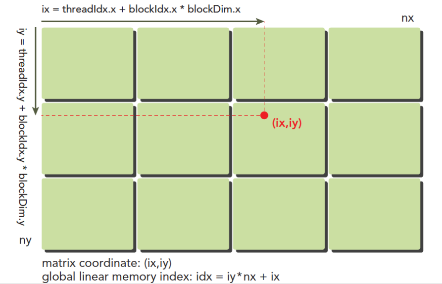
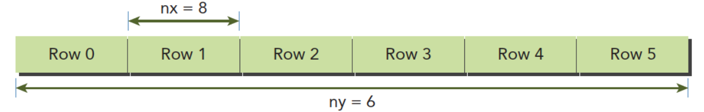

介绍每个线程如何确定唯一索引，建立并行计算，且不同的线程组织形式如何影响性能。

---
# 使用块和线程建立矩阵索引
线程的全局地址(ix, iy):
$$ ix = threadIdx.x + blockIdx.x * blockDim.x $$
$$ iy = threadIdx.y + blockIdx.y * blockDim.y $$



不同的线程执行相同的指令处理不同的数据
内存是线性存在的，所以数据存储也是线性存在的，比如一个二维矩阵(8*6)，在内存中存储如下图：

计算矩阵中(ix, iy)对应的线性内存的位置：
$$ idx = ix + iy*nx $$
用线程的全局坐标对应矩阵的坐标，形成一一对应关系，这样不同的线程就可以处理矩阵中不同的数据了。

下方代码输出每个线程的标号信息：
```
#include <cuda_runtime.h>
#include <stdio.h>
#include "freshman.h"

__global__ void printThreadIndex(float *A,const int nx,const int ny)
{
  int ix=threadIdx.x+blockIdx.x*blockDim.x;
  int iy=threadIdx.y+blockIdx.y*blockDim.y;
  unsigned int idx=iy*nx+ix;
  printf("thread_id(%d,%d) block_id(%d,%d) coordinate(%d,%d)"
          "global index %2d ival %2d\n",threadIdx.x,threadIdx.y,
          blockIdx.x,blockIdx.y,ix,iy,idx,A[idx]);
}
int main(int argc,char** argv)
{
  initDevice(0);
  int nx=8,ny=6;
  int nxy=nx*ny;
  int nBytes=nxy*sizeof(float);

  //Malloc
  float* A_host=(float*)malloc(nBytes);
  initialData(A_host,nxy);
  printMatrix(A_host,nx,ny);

  //cudaMalloc
  float *A_dev=NULL;
  CHECK(cudaMalloc((void**)&A_dev,nBytes));

  cudaMemcpy(A_dev,A_host,nBytes,cudaMemcpyHostToDevice);

  dim3 block(4,2);
  dim3 grid((nx-1)/block.x+1,(ny-1)/block.y+1);

  printThreadIndex<<<grid,block>>>(A_dev,nx,ny);

  CHECK(cudaDeviceSynchronize());
  cudaFree(A_dev);
  free(A_host);

  cudaDeviceReset();
  return 0;
}
```
---
# 二维矩阵加法
进行二维矩阵加法运算：
```
__global__ void sumMatrix(float * MatA,float * MatB,float * MatC,int nx,int ny)
{
    int ix=threadIdx.x+blockDim.x*blockIdx.x;
    int iy=threadIdx.y+blockDim.y*blockIdx.y;
    int idx=ix+iy*ny;
    if (ix<nx && iy<ny)
    {
      MatC[idx]=MatA[idx]+MatB[idx];
    }
}
```

---
接下来调整不同的线程组织形式，测试效率的区别
## 二维网格和二维块
```
// 2d block and 2d grid
dim3 block_0(dimx,dimy);
dim3 grid_0((nx-1)/block_0.x+1,(ny-1)/block_0.y+1);
iStart=cpuSecond();
sumMatrix<<<grid_0,block_0>>>(A_dev,B_dev,C_dev,nx,ny);
CHECK(cudaDeviceSynchronize());
iElaps=cpuSecond()-iStart;
printf("GPU Execution configuration<<<(%d,%d),(%d,%d)>>> Time elapsed %f sec\n",
      grid_0.x,grid_0.y,block_0.x,block_0.y,iElaps);
CHECK(cudaMemcpy(C_from_gpu,C_dev,nBytes,cudaMemcpyDeviceToHost));
checkResult(C_host,C_from_gpu,nxy);
```

## 一维网格和一维块
```
// 1d block and 1d grid
dimx=32;
dim3 block_1(dimx);
dim3 grid_1((nxy-1)/block_1.x+1);
iStart=cpuSecond();
sumMatrix<<<grid_1,block_1>>>(A_dev,B_dev,C_dev,nx*ny ,1);
CHECK(cudaDeviceSynchronize());
iElaps=cpuSecond()-iStart;
printf("GPU Execution configuration<<<(%d,%d),(%d,%d)>>> Time elapsed %f sec\n",
      grid_1.x,grid_1.y,block_1.x,block_1.y,iElaps);
CHECK(cudaMemcpy(C_from_gpu,C_dev,nBytes,cudaMemcpyDeviceToHost));
checkResult(C_host,C_from_gpu,nxy);
```

## 二维网格和一维块
```
// 2d block and 1d grid
dimx=32;
dim3 block_2(dimx);
dim3 grid_2((nx-1)/block_2.x+1,ny);
iStart=cpuSecond();
sumMatrix<<<grid_2,block_2>>>(A_dev,B_dev,C_dev,nx,ny);
CHECK(cudaDeviceSynchronize());
iElaps=cpuSecond()-iStart;
printf("GPU Execution configuration<<<(%d,%d),(%d,%d)>>> Time elapsed %f sec\n",
      grid_2.x,grid_2.y,block_2.x,block_2.y,iElaps);
CHECK(cudaMemcpy(C_from_gpu,C_dev,nBytes,cudaMemcpyDeviceToHost));
checkResult(C_host,C_from_gpu,nxy);
```

---
# 参考
[1] https://face2ai.com/CUDA-F-2-3-%E7%BB%84%E7%BB%87%E5%B9%B6%E8%A1%8C%E7%BA%BF%E7%A8%8B/