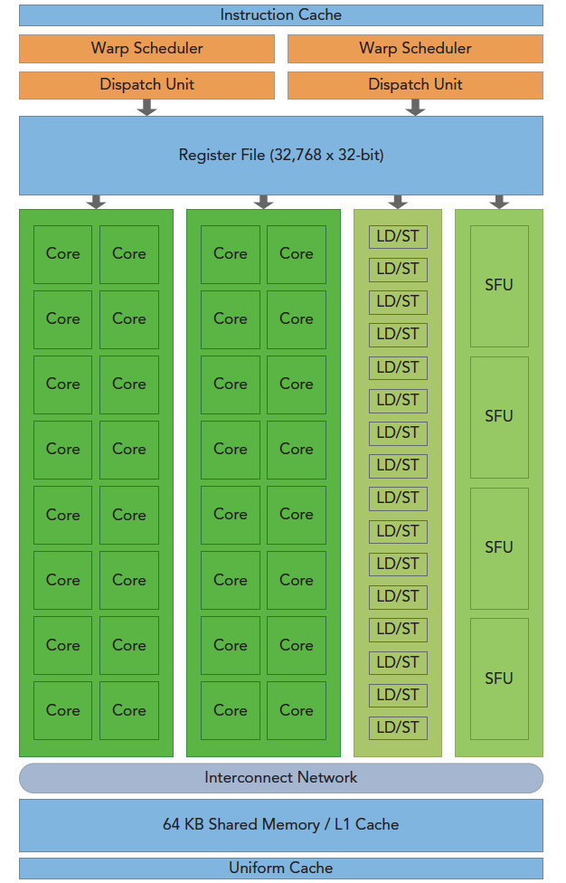
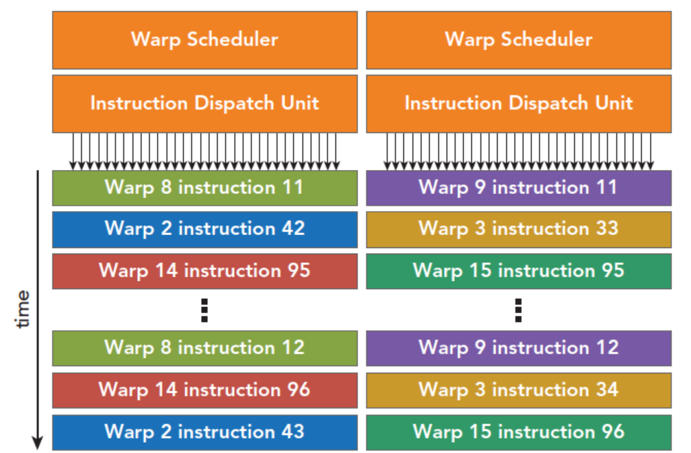
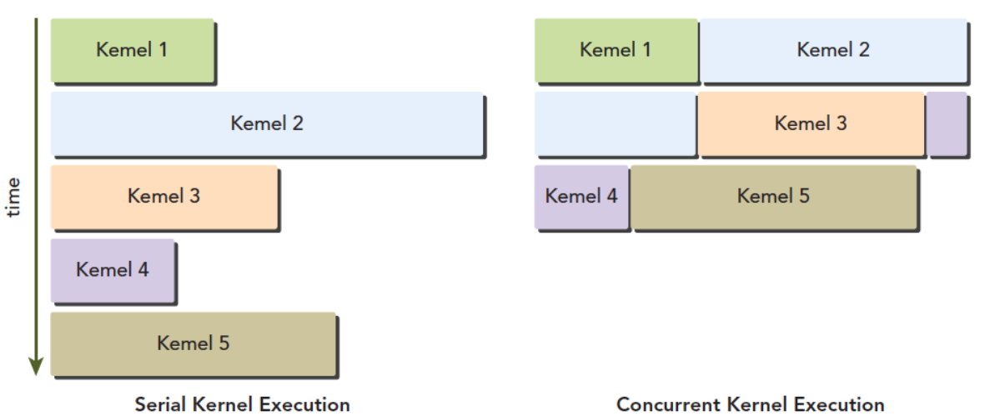

CUDA执行模型，只比硬件高一层的抽象
CUDA SM, SIMT, SIMD, Fermi, Kepler

---
# GPU架构
GPU架构是围绕流式多处理器（SM）的扩展阵列搭建的

包含：
- cuda core
- 共享内存/一级缓存
- 寄存器文件
- 加载/存储单元
- 特殊功能单元
- 线程束调度器

### SM
一个block只能在一个SM上执行，一个SM上可以有多个block
### 线程束
大部分设备的线程束都是32
32，从概念上讲，是SM以SIMD方式同时处理的工作粒度，一个SM在某一个时刻，有32个线程执行同一条指令，线程可以选择性执行指令，但是不能执行别的指令，需要等32个线程都执行完进行下一条指令。
### SIMD vs SIMT
SIMD 单指令多数据：比较死板，不允许每个分支有不同的操作，所有分支必须同时执行相同的指令，必须执行没有例外
SIMT 单指令多线程：某些线程可以选择不执行
SIMT保证了线程级别的并行，而SIMD更像是指令级别的并行
SIMT包括以下SIMD不具有的关键特性：
- 每个线程都有自己的指令地址计数器
- 每个线程都有自己的寄存器状态
- 每个线程可以有一个独立的执行路径

保证了各线程之间的独立

---
# CUDA编程组件与逻辑
编程模型解释的逻辑角度和硬件角度：

SM中有共享内存和寄存器，block中的线程通过共享内存和寄存器进行通信协调
逻辑上分为grid和block，但是实际上他们也是分批次在物理机器上执行的，线程块中的线程进度可能不一样，但是线程束wrap中的线程是相同的进度
同一个SM上可以有不止一个线程束，有些在执行，有些在等待，状态的转换不需要开销

# Fermi架构

Fermi架构包含：
- 512个加速核心，CUDA核
- 每个CUDA核心都有一个全流水线的整数算数逻辑单元ALU，和一个浮点数运算单元FPU
- CUDA核被组织到16个SM上
- 6个384-bits的GDDR5 的内存接口
- 支持6G的全局机载内存
- GigaThread，分配线程块到SM线程束调度器上
- 768KB的二级缓存，被所有SM共享

SM包含：
- 执行单元（CUDA核）
- 调度线程束的调度器和调度单元
- 共享内存，寄存器文件和一级缓存

每个多处理器SM有16个加载/存储单元所以每个时钟周期内有16个线程（半个线程束）计算源地址和目的地址

特殊功能单元SFU执行固有指令，如正弦，余弦，平方根和插值，SFU在每个时钟周期内的每个线程上执行一个固有指令
每个SM有两个线程束调度器，和两个指令调度单元，当一个线程块被指定给一个SM时，线程块内的所有线程被分成线程束，选择其中两个线程束，在用指令调度器存储两个线程束要执行的指令

Fermi还支持并发执行内核：

---
# Kepler架构
