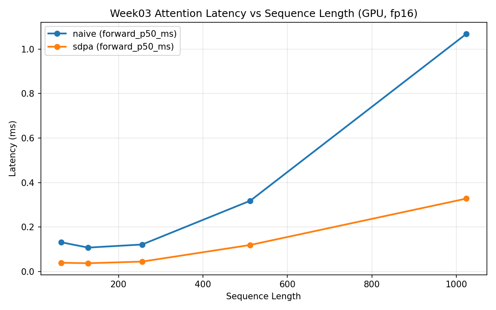
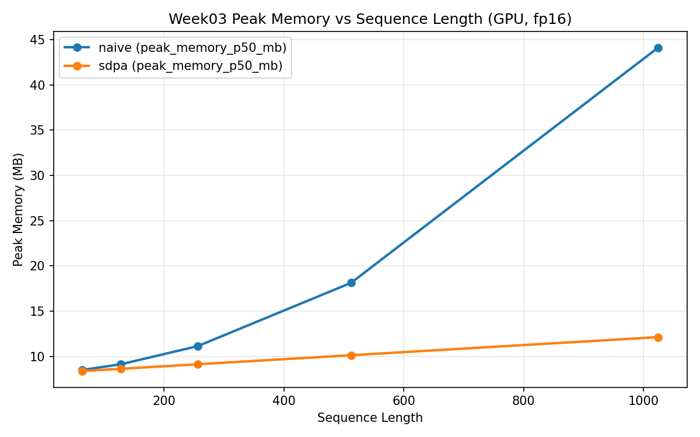

# Week 03 - Attention vs FlashAttention Baseline Report

## 1. Experiment Metadata
| Field | Value |
|---|---|
| Date | 20260421 |
| Environment |  |
| Device | GPU |
| PyTorch Version | |
| Warmup Iterations | 10 |
| Measured Iterations | 50 |
| batch_size / heads / head_dim | 1/8/64 |
| seq_lens | 64/128/256/512/1024 |

## 2. Benchmark Results

### 2.1 GPU
| Impl | Seq Len | Fwd P50 (ms) | Fwd P95 (ms) | Total P50 (ms) | Total P95 (ms) | Peak Mem P50 (MB) | Throughput (tokens/s) |
|---|---:|---:|---:|---:|---:|---:|---:|
| naive | 64 | 0.1321 | 0.1632 | 0.1956 | 0.2636 | 8.5 | 327225.1323 |
| naive | 128 | 0.108 | 0.1521 | 0.1797 | 0.2479 | 9.125 | 712250.7221 |
| naive | 256 | 0.1219 | 0.2407 | 0.1884 | 0.4169 | 11.125 | 1358695.622 |
| naive | 512 | 0.3185 | 0.3623 | 0.3927 | 0.4677 | 18.125 | 1303940.3498 |
| naive | 1024 | 1.0685 | 1.101 | 1.1724 | 1.2259 | 44.125 | 873433.987 |
| sdpa | 64 | 0.0399 | 0.0646 | 0.1085 | 0.1742 | 8.3755 | 589622.6443 |
| sdpa | 128 | 0.0378 | 0.0851 | 0.1258 | 0.2389 | 8.6255 | 1017423.3707 |
| sdpa | 256 | 0.0451 | 0.0661 | 0.1055 | 0.1914 | 9.1265 | 2427184.5016 |
| sdpa | 512 | 0.1198 | 0.148 | 0.1951 | 0.3274 | 10.1265 | 2624671.8796 |
| sdpa | 1024 | 0.3282 | 0.3334 | 0.4746 | 0.4839 | 12.1265 | 2157570.0181 |

## 3. Correctness Check (vs naive)
| Impl | Seq Len | Max Abs Err | Mean Abs Err | Note |
|---|---:|---:|---:|---|
| sdpa | 128 | 0.000977 | 5.1e-05 | |
| sdpa | 512 | 0.000732 | 2.9e-05 | |
| sdpa | 1024 | 0.000488 | 2.1e-05 | |

## 4. Curves / Plots

### 4.1 Latency vs Seq Len（`naive` vs `sdpa`）
基于 P50 的观察：
1. 随着 `seq_len` 增大，两条曲线都会上升，但 `sdpa` 的增长斜率明显更小。
2. 在前向耗时（forward）维度，`sdpa` 相对 `naive` 的加速区间为 2.66x ~ 3.31x。
3. 在总耗时（total）维度，加速区间为 1.43x ~ 2.47x；小序列下前后处理固定开销占比更高，会稀释总时延提升。

| Seq Len | Forward 加速比（`naive/sdpa`） | Total 加速比（`naive/sdpa`） |
|---:|---:|---:|
| 64 | 3.31x | 1.80x |
| 128 | 2.86x | 1.43x |
| 256 | 2.70x | 1.79x |
| 512 | 2.66x | 2.01x |
| 1024 | 3.26x | 2.47x |

### 4.2 Peak Memory vs Seq Len（GPU）
基于 P50 的观察：
1. `naive` 的显存随序列长度增长明显（8.5 MB -> 44.125 MB）。
2. `sdpa` 的显存增长更缓（8.3755 MB -> 12.1265 MB）。
3. 在 `seq_len=1024` 时，显存比值 `naive/sdpa = 3.64x`，说明长序列下 `sdpa` 的内存优势非常明显。

建议绘图：
1. `x=seq_len, y=forward_p50_ms`，两条曲线：`naive`、`sdpa`。
2. `x=seq_len, y=peak_memory_p50_mb`，两条曲线：`naive`、`sdpa`。

已生成图：

## 5. Key Findings
1. 在本实验设置（GPU, fp16, B=1, H=8, D=64）下，`sdpa` 在所有测试序列长度上均快于 `naive`：`forward_p50` 提升 2.66x~3.31x，`total_p50` 提升 1.43x~2.47x。
2. `sdpa` 的显存增长斜率更低；在 `seq_len=1024` 时，峰值显存由 `44.125 MB`（naive）降至 `12.1265 MB`（sdpa），约降低 72.5%。
3. 正确性检查稳定：`max_abs_err <= 9.77e-4`，`mean_abs_err` 在 `1e-5` 量级，符合 fp16 下预期误差范围。

## 6. FlashAttention Notes (v1/v2/v3)
1. FA1:
2. FA2:
3. FA3:

## 7. Risks / Issues
1. 
2. 

## 8. Next Step
- Week04: vLLM architecture reading (PagedAttention / Scheduler / KV Cache).
