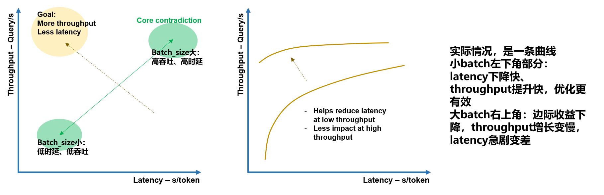

# 推理加速（持续迭代）

目标：
1. 把“概念理解 -> 实验数据 -> 面试表达”打通，避免只学名词。
2. 每周增量沉淀，24 周后形成可用于跳槽的系统化笔记。

---

## 0. 使用规则（每周都按这个更新）

每周新增 3 类内容：
1. 概念卡：新增或修订 3-5 个术语，必须写清“定义 + 怎么测 + 常见误区”。
2. 证据卡：至少 1 组真实实验数据（表格 + 结论 + 反例）。
3. 表达卡：沉淀 1 条“面试可直接讲”的 STAR/问题-分析-结论话术。

### 0.1 学习树总览（v0）

L1 指标与测量基础：
- latency、throughput、warmup、percentile（P50/P95/P99）
- batch、concurrency、queue time、service time
- 复现性（固定输入、固定轮次、固定版本）

L2 推理执行链路：
- 前处理（tokenization / decode）
- 模型前向（compute infer）
- 后处理（logits -> 输出格式）
- 端到端拆分（client send/recv、server queue、compute）

L3 系统优化手段：
- 动态批处理、并发调度
- 图优化/后端优化（PyTorch/ONNX Runtime/TensorRT）
- 精度与量化（FP16/INT8）

L4 架构与内核（后续周深入）：
- KV Cache、PagedAttention、FlashAttention
- CUDA kernel、memory hierarchy、occupancy

---

## 1. Week1 

### 1.1 必补概念

1. 推理性能指标 
   1. Latency vs. Throughput

      | 概念 | 定义 | 计量 | 衡量视角 | 
      |:---:|:---:|:---:|:---:|
      | Latency | 单次请求输入到输出的时间 | ms/s(seconds/token) | 用户体验（一个请求等待时间） |
      | Throughput | 单位时间处理请求数 | QPS | 系统能力（一秒能够服务几个人） |

      时延较为优秀的阈值是每分钟输出250个单词，约为人类的平均阅读速度
      区分端到端延迟与模型纯计算延迟
      吞吐提升不代表单次请求延迟一定下降

      <p align="center">
      <br>
      <em>图1：throughput & latency关系示意图</em>
      </p>

   2. 一些常计算性能指标
      - TTFT：Time To First Token，首token生成时间，衡量prefill性能指标
      - E2EL：End to End Latency，端到端时延，从输入提示词到生成所有结果返回结束
      - ITL：Inter Token Latency，解码阶段每个token生成时间 $ ITL = \frac{E2EL - TTFT}{N_{tokens}-1} $ (但是也有一些ITL采用TBT计算方式)
      - TBT：Time Between Tokens，生成token之间的时间差，指某个token生成时间 $ TBT_i = latency_i - latency_{i-1} $
      - TPOT：Time Per Output Token，所有token生成的平均时间，包括首token（不过这里有争议，现在很多普遍默认不计算首token，采用ITL计算方式）
      - QPS：Query Per Second，每秒处理请求数 $ QPS = \frac{N_{requests}}{T_{seconds}} $
      - TPS：Token Per Sencond，每秒吞吐量输出的token数  $ TPS = \frac{n_tokens}{T_y-T_x} $
      - QPM：Query Per Minute，每分钟处理请求数
      - TP90：Top Percentile，至少90%请求满足该条件，称为分位数延迟，还有TP50、TP99。P50是中位数，代表典型延迟，P95是尾延迟基准，P99是严格尾延迟。只看平均值会掩盖尾部问题，一般线上更看重P95/P99
      - RPS：Requests Per Second，每秒请求数，用于控制测试时请求注入速率，是吞吐量测试的重要参考指标
      - Ramp Up：爬坡测试，修改RPS测试服务性能
      - SLO：Service Level Objective，服务质量目标，确保为客户提供优质服务的关键
      - MFU：Model Flops Utilization，衡量模型对GPU算力资源使用效率
      - JCT：Job Completion Time，任务完成时间，整个agent任务从开始到结束的时间
   3. KV cache
      serving系统把之前token的key和value缓存起来，形成KV cache。
      特点：
      - 极大加速decode
      - 占用巨大显存
      - 长上下文、多并发、多轮agent都会让KV cache压力变大
      - serving系统决定如何分配、复用、驱逐KV cache
   4. prefix caching
      如果多个请求有相同前缀，系统可以缓存这部分的KV，不用重新prefill。agent场景非常适合prefix caching，因为有很多内容反复出现，比如system prompt, tool descriptions, developer instructions, few-shot examples等。但是实际命中不一定高，因为tool schema顺序改变、prompt时间戳、JSON空格/换行不一致、session被路由到不同实例等
   5. continuous batching
      - 普通batching：一批请求凑齐，一起跑，等待全部结束了，换下一批。但是LLM请求长度差异大，这样会浪费gpu
      - continuous batching：每个decode step动态地把活跃请求组成batch，vllm、sglang这类serving engine都是continuous batching
   6. Disaggregated Inference / PD 分离
      - 把prefill和decode分开部署，prefill大矩阵计算多，和输入长度相关；decode逐token生成，KV cache访问重，对延迟敏感。把他们放在不同的gpt pool，更好地调度资源。不过这个过程会引入新问题，如：prefill产生的KV cache如何传给decode，网络传输开销有多少，prefill和decode gpu比例怎么分配等
2. Prefilling & Decoding
- prefill：预填充，并行处理输入的所有token
   - 一次完整的前向传播，生成KV cache，输出第一个token，这个时间与输入的token有关
- decoding：解码，逐个生成下一个token
   - output token的数量决定了需要进行多少次前向传播

3. 推理工程中的一些概念和指标
   1. Warmup（预热）
      - 定义：正式计时前先执行若干轮，消除首次执行抖动。
      - 典型抖动来源：懒加载、缓存建立、内核选择、内存页映射。
   2. Batch Size
      - 一般batch增大可提升吞吐，但可能拉高单请求延迟
      - batch_size为什么吃显存？因为每增加一个batch，多一份kv cache

      <p align="center">
      <br>
      <em>图1：batch_size估算实例</em>
      </p>

   3. Concurrency 并发
      - 并发升高后，系统可能从“算力瓶颈”转为“排队瓶颈”。
   4. Queue Time vs Compute Time
      - 拆分来确认是排队慢还是计算慢
      - stage breakdown阶段拆分，至少是preprocess / forward / postprocess三段

4. Pytorch推理相关
   1. `model.eval()` vs `torch.inference_mode()` vs `torch.no_grad()`

      | 特性 | `model.eval()` | `torch.no_grad()` | `torch.inference_mode()` | 
      |:---:|:---:|:---:|:---:|
      | 主要职责 | 切换模型行为模式 | 禁用梯度计算 | 禁用梯度+更深度优化 |
      | 影响Dropout | ✅ | ❌ | ❌ |
      | 影响BatchNorm | ✅ | ❌ | ❌ |
      | 禁用梯度追踪 | ❌ | ✅ | ✅ |
      | 禁用张量版本计数器 | ❌ | ❌ | ✅ |
      | 禁用inplace历史检查 | ❌ | ❌ | ✅ |
      | 引入版本 | 早期 | 早期 | Pytorch 1.9+ |
      | 使用方式 | 方法调用 | 上下文管理器/装饰器 | 上下文管理器/装饰器 |

      一般实践时用 `model.eval()` + `torch.inference_mode()`
   2. `torch.utils.benchmark.Timer`
      1. 在统计gpu时间时，不能用 `time.time()`计时，因为gpu是异步执行的
      2. `torch.utils.benchmark`有哪些模块
         | 类/模块 | 核心能力 |	关键方法 |
         |:---:|:---:|:---:|
         | Timer | 壁钟计时 + warmup + CUDA同步 | blocked_autorange, adaptive_autorange, timeit |
         | Timer | 指令计数 | collect_callgrind |
         | Measurement | 结果存储 + 统计量 | .median, .iqr, .merge() |
         | CallgrindStats | Callgrind 结果分析 | .stats(), .delta(), .as_standardized() |
         | unctionCounts | 函数级指令操作 | .filter(), .transform(), .denoise(), 加减法 |
         | Compare |	多结果格式化对比 | .colorize(), .print(), .trim_significant_figures() |
         | Fuzzer | 随机输入生成（隐藏功能） | .take(n) → 随机张量生成器 |


   3. `torch.cuda.Event` 与 `torch.utils.benchmark.Timer` 的关系

      - 两者都是计时工具，但口径不同。
      - `Timer` 更偏“Python侧/端到端代码段计时”，适合统一管理warmup、重复测量和统计。
      - `torch.cuda.Event` 更偏“GPU设备侧计时”，能更准确测 kernel 执行时间，不把大量 CPU 等待/调度开销混进来。
      - 实践建议：
         1. 要看端到端请求时延：优先 `Timer`（或 `perf_counter`）+ 明确同步策略。
         2. 要做 GPU 阶段拆分（pre/forward/post）：优先 `cuda.Event`。

   4. `torch.cuda.Event` 原理与用法

      原理：
      - CUDA 默认异步执行。CPU 提交算子后会很快返回。
      - `torch.cuda.Event` 会在 CUDA stream 中打时间戳。
      - `start.elapsed_time(end)` 返回的是 GPU 设备侧从 `start` 到 `end` 的耗时（毫秒）。
      - 必须在读取结果前确保事件已完成（通常 `end.synchronize()` 或全局 `torch.cuda.synchronize()`）。

      标准用法：

      ```python
      start = torch.cuda.Event(enable_timing=True)
      end = torch.cuda.Event(enable_timing=True)

      start.record()
      # GPU work
      y = model(x)
      end.record()

      end.synchronize()  # 或 torch.cuda.synchronize()
      ms = start.elapsed_time(end)
      ```

         阶段拆分用法（pre/forward/post）：

      ```python
      e0 = torch.cuda.Event(enable_timing=True)
      e1 = torch.cuda.Event(enable_timing=True)
      e2 = torch.cuda.Event(enable_timing=True)
      e3 = torch.cuda.Event(enable_timing=True)

      e0.record()
      x = torch.randn(..., device='cuda')
      e1.record()

      with torch.inference_mode():
         y = model(x)
      e2.record()

      _ = torch.argmax(y, dim=1)
      e3.record()

      e3.synchronize()

      pre_ms = e0.elapsed_time(e1)
      fwd_ms = e1.elapsed_time(e2)
      post_ms = e2.elapsed_time(e3)
      total_ms = e0.elapsed_time(e3)
      ```

      常见误区：
      1. 只在 `model(x)` 前后用 `perf_counter`，但不做同步，得到的 GPU 时间会偏小。
      2. 每个阶段都强行 `torch.cuda.synchronize()`，会把额外等待开销放大，导致小 batch 下延迟异常增大。
      3. 混用不同计时口径（device-time vs wall-time）后直接横向比较，结论会失真。

      建议在报告里标注计时口径：
      - `timing_backend = cuda_event`（设备侧）
      - `timing_backend = perf_counter`（墙钟时间）

##### 参考资料
[1] https://zhuanlan.zhihu.com/p/1983137653336585901
[2] https://zhuanlan.zhihu.com/p/680459342

---

### 1.2 Week1 学习资料（按优先级）

P0（本周必读）：
1. PyTorch `inference_mode` 文档（理解推理时为何比 `no_grad` 更少开销）
   - https://docs.pytorch.org/docs/stable/generated/torch.autograd.grad_mode.inference_mode.html
2. PyTorch `torch.utils.benchmark`（理解 warmup、同步、统计测量）
   - https://docs.pytorch.org/docs/stable/benchmark_utils.html
   - https://docs.pytorch.org/tutorials/recipes/recipes/benchmark.html
   - https://pytorch-cn.com/tutorials/recipes/recipes/benchmark.html
3. Triton Perf Analyzer 输出解释（学习 queue/compute/client latency 拆分）
   - https://docs.nvidia.com/deeplearning/triton-inference-server/user-guide/docs/perf_analyzer/docs/benchmarking.html
4. Triton Model Analyzer 指标定义（对齐 latency/throughput/p95 指标口径）
   - https://docs.nvidia.com/deeplearning/triton-inference-server/user-guide/docs/model_analyzer/docs/metrics.html

P1（建议预读，为 Week2/Week8 铺垫）：
1. ONNX Runtime 性能调优总览
   - https://onnxruntime.ai/docs/performance/tune-performance/
2. Triton GenAI-Perf（提前认识 TTFT / ITL / token throughput）
   - https://docs.nvidia.com/deeplearning/triton-inference-server/archives/triton-inference-server-2640/user-guide/docs/perf_benchmark/genai_perf.html

---

### 1.3 Week1 最小完成标准（可直接打勾）

- [x] 我能解释 latency / throughput / warmup / P50-P95 的定义和关系。
- [x] 我能解释为何 batch 上升时吞吐上升但单请求延迟可能变差。
- [x] 我有一张 stage breakdown 表（preprocess/forward/postprocess）。
- [x] 我有一张 batch sweep 表（>=3 组 batch）并给出结论。
- [x] 我记录了测量协议（warmup、测量轮次、输入、版本）。

---

## 2. Week2

### 2.1 `torch.compile`
1. 解释 torch.compile 的编译链路和适用场景。
   适合场景：
   1. 模型会被重复调用很多次（推理服务、训练循环），能摊薄首次编译开销。
   2. 算子链较长、Python 调度开销明显，图融合后有收益。
   3. 输入形状相对稳定，或者你已做好 dynamic shape 策略。
   4. 愿意做 benchmark 和少量排障（因为这个不是“一键必快”工具）。
   不适合场景：
   1. 只跑几次就结束的脚本
   2. 控制流非常复杂，频繁graph break的代码
   3. 输入shape乱跳且没做动态策略时
2. torch.compile(..., mode=...) 的模式差异（default / reduce-overhead / max-autotune）
   1. `default`模式：平衡“编译开销”和“运行性能”
   2. `reduce-overhead`目标是降低python调用开销，重点依赖 CUDA Graph 路径，在小 batch、调用特别频繁的 GPU 推理常见有效，在 CPU 上通常不是主力模式
   3. `max-autotune`：更激进地做 autotune（例如 matmul/conv 相关内核选择），通常编译更慢，但长时间稳定运行时可能更快
3. graph break 是什么，为什么会让加速效果变差
   1. graph指可被编译器整体优化的一段计算图（FX graph）
   2. `graph break`：Dynamo追踪时遇到无法纳入图的代码，会把图截断。就会发生“图编译执行 -- python执行 -- 新建图编译执行”
4. 输入 shape 变化为什么会触发重新编译
   1. 编译后的图不是“无限通用”，它带有 guards（有效条件），比如某维度必须等于某值或满足某约束。
   2. 新输入 shape 触发 guard 失败，就会 recompile。
5. 如何用 TORCH_LOGS 定位问题
   1. `TORCH_LOGS="graph_breaks,recompiles,dynamic,guards,perf_hints,graph_code"` 可用这几个常用的。
      1. `graph_breaks`：查看哪里断图，为什么断
      2. `recompiles`：哪次重编译，哪个guard失败
      3. `dynamic`：动态shape相关决策
      4. `guards`：编译假设条件
      5. `perf_hints`：性能提示
      6. `graph_mode`：Dynamo产出的图代码

---

## 3. Week3

### 3.1 transformer

1. 输入表示（Embedding + Positional Encoding）
- 词向量：把 token id 映射到连续向量空间。
- 位置编码：给模型注入顺序信息（因为纯 attention 本身不含顺序）。
- 最终输入可写为：
  \[
  X = E_{token} + E_{position}
  \]

2. 正余弦位置编码（Sinusoidal Positional Encoding）
- 论文中的固定位置编码定义：
  \[
  PE_{(pos,2i)} = \sin\left(\frac{pos}{10000^{2i/d_{model}}}\right),
  \quad
  PE_{(pos,2i+1)} = \cos\left(\frac{pos}{10000^{2i/d_{model}}}\right)
  \]
- 含义：
  - \(pos\)：位置索引（第几个 token）。
  - \(i\)：通道维度索引，不同维度对应不同频率。
  - 偶数维用 \(\sin\)，奇数维用 \(\cos\)。
- 直觉：
  - 低频维度负责更“平滑、全局”的位置信息。
  - 高频维度负责更“细粒度、局部”的位置信息。
  - 多频率叠加后，模型更容易分辨不同位置和相对位移关系。
- 为什么常说它有外推能力：
  - 这是解析函数，不是查表参数；遇到训练中没见过的位置，也能按公式直接计算编码。
- 实践提醒：
  - 原始 Transformer 用固定正余弦；很多现代大模型改用可学习绝对位置、RoPE、ALiBi 等方案以获得更好的长上下文效果。

3. 缩放点积注意力（Scaled Dot-Product Attention）
- 先做线性映射：
  \[
  Q = XW_Q,\; K = XW_K,\; V = XW_V
  \]
- 核心公式：
  \[
  \text{Attention}(Q,K,V) = \text{softmax}\left(\frac{QK^T}{\sqrt{d_k}}\right)V
  \]
- 直觉：
  - \(QK^T\)：查询和键的相关性打分。
  - softmax：把打分归一化成权重。
  - 乘 \(V\)：按权重对 value 做加权求和。

4. 为什么要除以 \(\sqrt{d_k}\)（缩放因子）
- 当 \(d_k\) 很大时，点积值方差会变大，softmax 容易饱和（接近 one-hot）。
- softmax 饱和后梯度变小，训练不稳定。
- 除以 \(\sqrt{d_k}\) 可以把数值拉回更稳定范围，改善优化过程。

5. 多头注意力（Multi-Head Attention, MHA）
- 单头表达：
  \[
  \text{head}_i = \text{Attention}(QW_Q^{(i)}, KW_K^{(i)}, VW_V^{(i)})
  \]
- 拼接并线性变换：
  \[
  \text{MHA}(Q,K,V)=\text{Concat}(\text{head}_1,\ldots,\text{head}_h)W_O
  \]
- 作用：不同头可以学习不同关系（局部/全局、语义/语法等），提升表达能力。

6. Transformer Block 的标准流程
- Encoder block：
  1) MHA
  2) Add & LayerNorm（残差连接 + 归一化）
  3) FFN
  4) Add & LayerNorm
- FFN 常见形式：
  \[
  \text{FFN}(x)=\sigma(xW_1+b_1)W_2+b_2
  \]
  其中 \(\sigma\) 常用 ReLU/GELU。

7. Decoder 与自回归（Auto-regressive）
- Decoder 的 self-attention 使用 causal mask，保证“当前位置只能看见过去 token”。
- 自回归生成：第 \(t\) 步预测依赖 \(1\ldots t-1\) 的上下文。
- 你在推理中看到的 prefill/decode，本质就是：
  - prefill：并行处理已有上下文，建立状态（如 KV cache）
  - decode：逐 token 迭代生成

8. 复杂度与推理瓶颈（为什么后续有 FlashAttention）
- 对序列长度 \(n\)，attention score 矩阵是 \(n\times n\)。
- 时间/显存核心开销随 \(n\) 增长明显（常讨论为 \(O(n^2)\) 级别瓶颈）。
- 这就是长序列场景下需要 FlashAttention、PagedAttention 等优化的根因。

- ps: **受限自注意力机制**，通过限制每个元素在计算注意力时捕捉的序列范围，降低计算复杂度，牺牲一部分全局依赖建模能力来换取计算效率。将复杂度从 $O(n^2 \cdot d)$降低到 $O(r \cdot n \cdot d)$

9. 必须能讲清的“面试版一句话”
- Transformer 用“Q-K 相关性 + V 加权聚合”替代了循环结构；多头增强表达，缩放稳定训练；自回归 + mask 保证因果生成；长序列瓶颈来自 attention 的 \(n^2\) 级别计算与内存访问。

10. 常见误区
- 误区1：attention 权重越尖锐越好。实际上过度尖锐会影响梯度与泛化。
- 误区2：多头只是参数变多。更关键是“子空间分工建模”。
- 误区3：Transformer 推理慢只是算力不够。很多时候是显存带宽与数据搬运（IO）瓶颈。

##### 参考资料
[1] Vaswani et al., Attention Is All You Need, 2017: https://arxiv.org/abs/1706.03762
[2] Transformer 结构可视化讲解: https://explainer.tubex.chat/

---
## 4. Week5


---

## 周更模板（复制到后续 Week）

````markdown
## WeekXX 增量

### A. 概念卡（新增/修订）
1. 术语：
- 定义：
- 怎么测：
- 常见误区：

### B. 证据卡（实验）
- 配置：
- 关键结果（表格）：
- 结论：
- 反例/失败点：

### C. 表达卡（面试）
- 问题场景：
- 我的分析：
- 我的动作：
- 结果与权衡：
````

---


