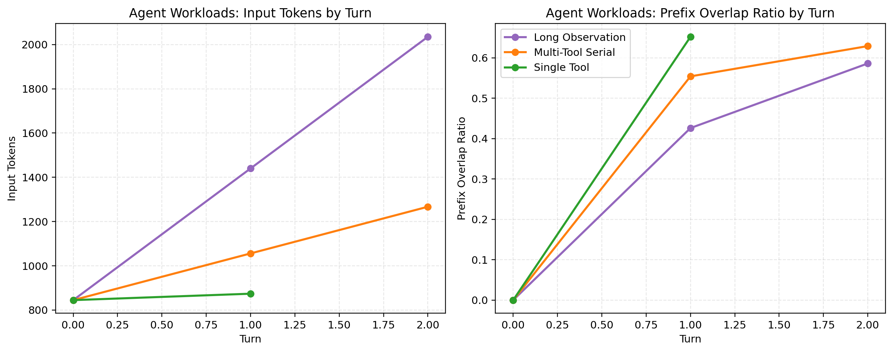
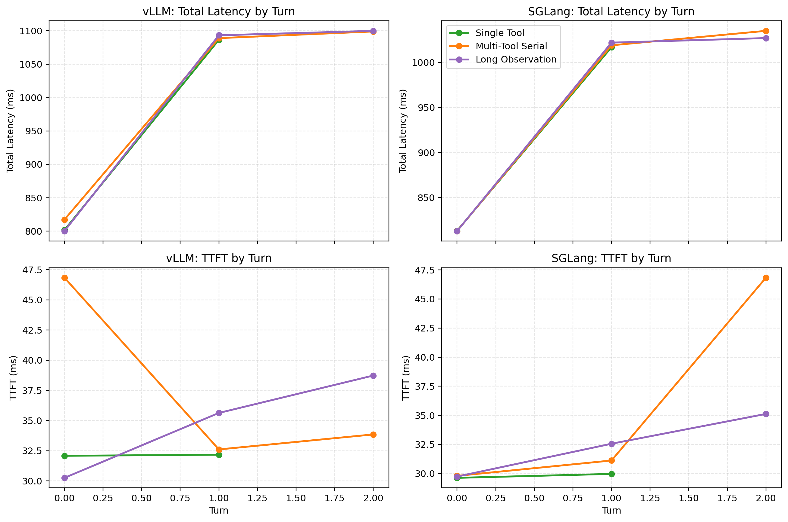
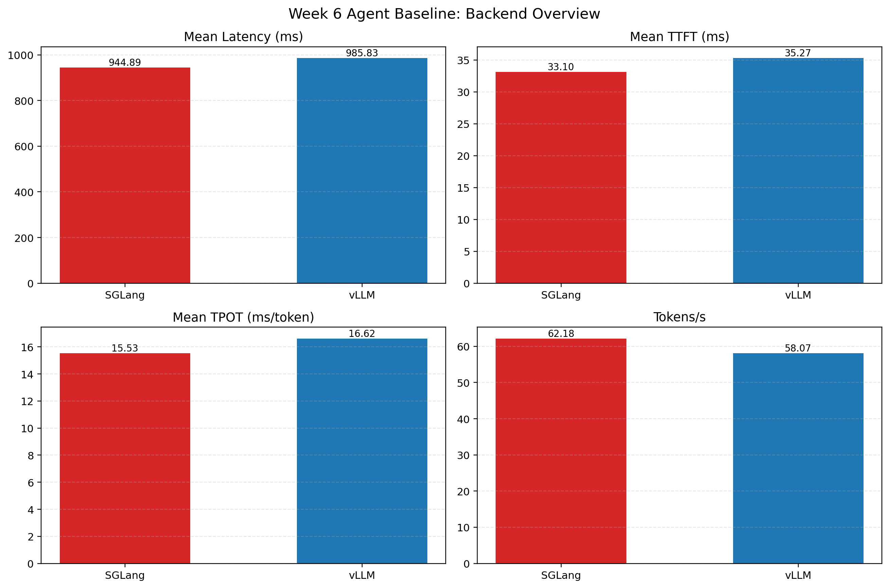

# Week 06 Agent Baseline

## 1. 实验目的

本实验对应 Week 6 Day 2，目标是在统一流式服务接口下，对 3 类 Agent-style workload 做首轮系统对比：

1. `single_tool`
2. `multi_tool_serial`
3. `long_observation`

希望回答的问题是：

1. Agent workload 与 plain chat 相比，输入 token 结构和时延表现有何不同。
2. 多轮 history 与长 observation 会如何推动 prompt 膨胀。
3. vLLM 与 SGLang 在 Agent-style workload 下是否呈现和 plain chat 一致的趋势。

## 2. 实验环境与配置

### 2.1 环境

| 项目 | 值 |
|---|---|
| GPU | NVIDIA GeForce RTX 4090 D 24GB |
| Driver | 570.124.04 |
| CUDA | 12.8 |
| Python | 3.11.15 |
| 模型 | `/root/autodl-tmp/models/Qwen2.5-7B-Instruct` |
| 调用方式 | OpenAI-compatible streaming server |

### 2.2 配置文件

- `configs/week06_agent_vllm_server.yaml`
- `configs/week06_agent_sglang_server.yaml`

### 2.3 Workload 设计

为保证在 `4096` 上下文长度内稳定运行，本轮采用收缩后的 Agent baseline：

| Workload | system tokens | tool count | tool tokens | turns | observation tokens |
|---|---:|---:|---:|---:|---:|
| `single_tool` | 64 | 2 | 16 | 2 | 0 |
| `multi_tool_serial` | 64 | 2 | 16 | 3 | 32 |
| `long_observation` | 64 | 2 | 16 | 3 | 96 |

## 3. 原始结果路径

- vLLM: `experiments/runs/week06/agent_baseline/vllm_server/`
- SGLang: `experiments/runs/week06/agent_baseline/sglang_server/`

对应 summary 文件：

- `summary.md`
- `results.json`
- `repeat_summary.json`

## 4. 核心图表

### 4.1 Agent workload 结构变化

### 4.2 Agent workload 时延与 TTFT

### 4.3 Backend 总览

## 5. 结果汇总

### 5.1 汇总指标

| Backend | Mean Latency (ms) | Mean TTFT (ms) | Mean TPOT (ms/token) | Tokens/s | Requests/s |
|---|---:|---:|---:|---:|---:|
| vLLM | 985.83 | 35.27 | 16.62 | 58.07 | 1.01 |
| SGLang | 944.89 | 33.10 | 15.53 | 62.18 | 1.06 |

### 5.2 vLLM: 按 workload / turn 展开

| Workload | Turn | Input Tokens | Output Tokens | TTFT (ms) | Total Latency (ms) | TPOT (ms/token) | Prefix Overlap Ratio |
|---|---:|---:|---:|---:|---:|---:|---:|
| `single_tool` | 0 | 845 | 46 | 32.08 | 801.70 | 16.73 | 0.0000 |
| `single_tool` | 1 | 874 | 64 | 32.17 | 1086.45 | 16.47 | 0.6519 |
| `multi_tool_serial` | 0 | 845 | 46 | 46.84 | 817.28 | 16.75 | 0.0000 |
| `multi_tool_serial` | 1 | 1056 | 64 | 32.61 | 1088.98 | 16.51 | 0.5540 |
| `multi_tool_serial` | 2 | 1267 | 64 | 33.85 | 1098.96 | 16.64 | 0.6289 |
| `long_observation` | 0 | 845 | 46 | 30.25 | 800.20 | 16.74 | 0.0000 |
| `long_observation` | 1 | 1440 | 64 | 35.63 | 1093.22 | 16.52 | 0.4260 |
| `long_observation` | 2 | 2035 | 64 | 38.73 | 1099.89 | 16.58 | 0.5859 |

### 5.3 SGLang: 按 workload / turn 展开

| Workload | Turn | Input Tokens | Output Tokens | TTFT (ms) | Total Latency (ms) | TPOT (ms/token) | Prefix Overlap Ratio |
|---|---:|---:|---:|---:|---:|---:|---:|
| `single_tool` | 0 | 845 | 50 | 29.63 | 813.09 | 15.67 | 0.0000 |
| `single_tool` | 1 | 874 | 64 | 29.97 | 1017.03 | 15.42 | 0.6519 |
| `multi_tool_serial` | 0 | 845 | 50 | 29.80 | 812.88 | 15.66 | 0.0000 |
| `multi_tool_serial` | 1 | 1056 | 64 | 31.12 | 1019.08 | 15.44 | 0.5540 |
| `multi_tool_serial` | 2 | 1267 | 64 | 46.84 | 1035.14 | 15.44 | 0.6289 |
| `long_observation` | 0 | 845 | 50 | 29.74 | 812.78 | 15.66 | 0.0000 |
| `long_observation` | 1 | 1440 | 64 | 32.56 | 1022.05 | 15.46 | 0.4260 |
| `long_observation` | 2 | 2035 | 64 | 35.12 | 1027.11 | 15.50 | 0.5859 |

## 6. 结果解读

### 6.1 Agent workload 的输入膨胀是清晰可见的

从图 4.1 可以看到，三类 Agent workload 在 turn 维度上都表现出明显的输入增长，但增长速度不同：

- `single_tool`: `845 -> 874`
- `multi_tool_serial`: `845 -> 1056 -> 1267`
- `long_observation`: `845 -> 1440 -> 2035`

这说明：

1. 固定 system prompt + tool schema 本身就有显著成本，Agent workload 的第一轮输入已经明显高于简单 plain chat。
2. 多轮 history 会持续拉长 prompt。
3. 长 observation 是最主要的输入膨胀来源。

### 6.2 prefix overlap ratio 随轮次上升，但不能抵消 observation 带来的 prompt 膨胀

`multi_tool_serial` 和 `long_observation` 的 prefix overlap ratio 都随 turn 增长而上升，这说明多轮交互确实存在前缀复用机会。

但更重要的是，`long_observation` 在 prefix overlap 上升的同时，input tokens 依然快速增长到 `2035`。这说明：

- Agent workload 并不是“prefix overlap 高，所以自然很省”；
- 真实系统里，history 与 observation 的膨胀常常会盖过单纯的前缀复用收益；
- 这正是后续研究 prefix cache / canonicalization 的动机来源。

### 6.3 total latency 主要受 workload 结构驱动，而 TTFT 增长相对平缓

从图 4.2 可以看到，随着 turn 增长，`total latency` 基本稳定上升，但 `TTFT` 的增长幅度相对温和。

这带来两个判断：

1. 在当前上下文长度范围内，Agent 多轮的主要问题仍是“整体请求完成时间变长”，而不是 TTFT 单点异常膨胀。
2. `long_observation` 比 `multi_tool_serial` 更接近 prefill-heavy 场景，但它在这一轮实验里还没有把 TTFT 拉到完全失控的程度。

### 6.4 SGLang 在 Agent baseline 中仍略优于 vLLM

与 plain baseline 类似，SGLang 在 Agent workload 下也表现出更低的平均时延和更低的 TPOT：

- mean latency: `944.89 ms` vs `985.83 ms`
- mean TPOT: `15.53 ms/token` vs `16.62 ms/token`
- tokens/s: `62.18` vs `58.07`

这说明 SGLang 的优势并不只存在于简单 plain chat，而是在当前 Agent workload 下也能延续。

不过两者差距不算极端，因此这更适合作为“趋势观察”，而不是夸张地上升为最终结论。

## 7. 与 plain baseline 的关系

把这组结果与 plain baseline 放在一起看，可以得到更重要的判断：

1. Agent 第一轮的输入 token 已经显著高于 plain short request。
2. Agent workload 的时延变化不是简单的单轮 chat 放大，而是受到 `tool schema + history + observation` 共同影响。
3. `long_observation` 明确展示了工具返回内容会如何推动 prompt 膨胀，这为 Day 4 prefix cache 开关实验和 Day 5 profiling 提供了明确方向。

换句话说，Agent 推理并不是普通 chat 的机械重复，而是“长前缀 + 多轮累积 + 长 observation”共同塑造的特殊负载。

## 8. 限制与注意事项

1. 当前 `concurrency=1`，因此结果不能代表并发场景。
2. 实际输出 tokens 仍可能早于目标值结束，因此不同请求之间不完全是严格定长输出。
3. 第一轮 warmup 明显偏慢，正式比较应更多参考后两轮稳定区间。
4. 当前 workload 已经为适配 `4096` 上下文长度做过收缩，因此它是“可运行 baseline”，不是最终极限 workload。

## 9. 结论

这组 Week 6 Agent baseline 已经足够支持后续工作推进，当前结论可以概括为：

1. Agent workload 相比 plain chat 具有更高的固定前缀成本和更明显的 turn-by-turn 输入增长。
2. `long_observation` 是最值得关注的 workload，因为它最能代表 Agent 场景中的 prompt 膨胀压力。
3. prefix overlap ratio 的增长说明后续做 prefix cache / canonicalization 具有现实动机。
4. 在当前配置下，SGLang 在 Agent workload 中仍略优于 vLLM，但差异尚不足以上升为强结论。
5. 这组结果已经可以作为 Week 6 Day 4 prefix cache 开关实验的 baseline reference。
