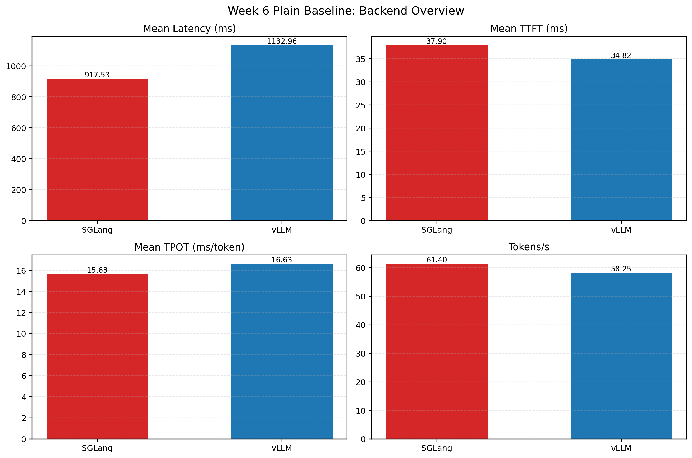
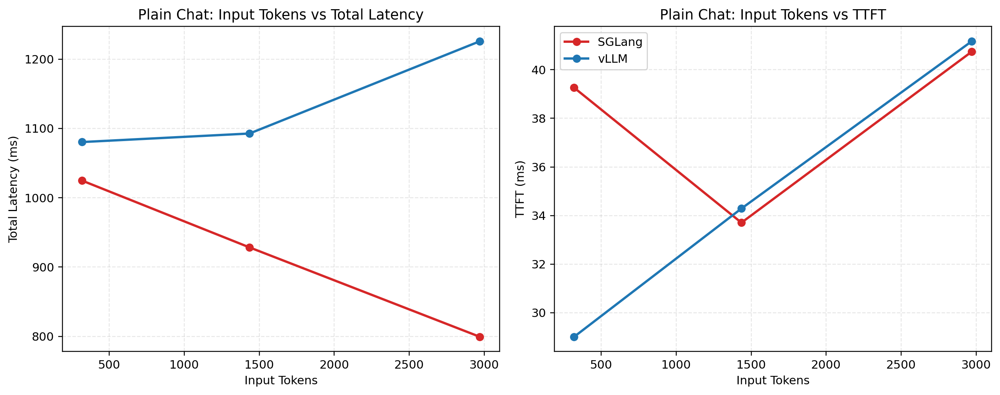

# Week 06 Plain Baseline

## 1. 实验目的

本实验对应 Week 6 Day 1，目标是在统一的流式服务接口下，对 `vLLM` 与 `SGLang` 的普通对话场景做一组可复现的 baseline 对比，回答两个问题：

1. 在当前单卡 4090D、Qwen2.5-7B-Instruct、本地流式服务部署条件下，两套 serving 框架的 `TTFT / total latency / TPOT / throughput` 表现如何。
2. 随着输入 prompt 变长，普通 chat workload 的时延增长趋势是否稳定，以及这种趋势能否作为后续 Agent workload 对比的基线。

这份报告只讨论 `plain_chat`，不讨论多轮 Agent 行为，也不直接给出最终工程结论。

## 2. 实验环境与配置

### 2.1 环境

| 项目 | 值 |
|---|---|
| GPU | NVIDIA GeForce RTX 4090 D 24GB |
| Driver | 570.124.04 |
| CUDA | 12.8 |
| Python | 3.11.15 |
| 模型 | `/root/autodl-tmp/models/Qwen2.5-7B-Instruct` |
| 调用方式 | OpenAI-compatible streaming server |

### 2.2 配置文件

- `configs/week06_plain_vllm_server.yaml`
- `configs/week06_plain_sglang_server.yaml`

### 2.3 Workload 设计

本次 plain baseline 使用 3 组单轮请求：

| Workload | 目标 prompt 规模 | 目标输出规模 |
|---|---:|---:|
| `plain_chat_cfg00` | 64 | 64 |
| `plain_chat_cfg01` | 256 | 64 |
| `plain_chat_cfg02` | 512 | 128 |

注意：配置中的 token budget 是 workload 构造目标，不等于真实 tokenizer 计数。实际输入 token 数通过 Qwen tokenizer 重新统计。

## 3. 原始结果路径

- vLLM: `experiments/runs/week06/plain_baseline/vllm_server/`
- SGLang: `experiments/runs/week06/plain_baseline/sglang_server/`

对应 summary 文件：

- `summary.md`
- `results.json`
- `repeat_summary.json`

## 4. 核心图表

### 4.1 Backend 总览

### 4.2 输入长度与时延关系

## 5. 结果汇总

### 5.1 汇总指标

| Backend | Mean Latency (ms) | Mean TTFT (ms) | Mean TPOT (ms/token) | Tokens/s | Requests/s |
|---|---:|---:|---:|---:|---:|
| vLLM | 1132.96 | 34.82 | 16.63 | 58.25 | 0.88 |
| SGLang | 917.53 | 37.90 | 15.63 | 61.40 | 1.09 |

### 5.2 单请求粒度结果

| Backend | Workload | 实际输入 tokens | 实际输出 tokens | TTFT (ms) | Total Latency (ms) | TPOT (ms/token) | Finish Reason |
|---|---|---:|---:|---:|---:|---:|---|
| vLLM | `plain_chat_cfg00` | 319 | 64 | 29.01 | 1080.41 | 16.43 | `length` |
| vLLM | `plain_chat_cfg01` | 1435 | 64 | 34.29 | 1092.70 | 16.54 | `length` |
| vLLM | `plain_chat_cfg02` | 2971 | 70 | 41.17 | 1225.78 | 16.92 | `stop` |
| SGLang | `plain_chat_cfg00` | 319 | 64 | 39.26 | 1024.72 | 15.40 | `length` |
| SGLang | `plain_chat_cfg01` | 1435 | 57 | 33.70 | 928.41 | 15.70 | `stop` |
| SGLang | `plain_chat_cfg02` | 2971 | 48 | 40.74 | 799.44 | 15.81 | `stop` |

## 6. 结果解读

### 6.1 SGLang 在本轮 plain baseline 中整体更快

从汇总指标看，SGLang 的 mean latency 为 `917.53 ms`，低于 vLLM 的 `1132.96 ms`；mean TPOT 为 `15.63 ms/token`，也低于 vLLM 的 `16.63 ms/token`。Tokens/s 与 Requests/s 也略高。

这说明在当前配置、当前模型和当前单请求串行执行条件下，SGLang 的 decode 侧效率略优于 vLLM。

### 6.2 两个 backend 的 TTFT 差距不大

vLLM 的 mean TTFT 为 `34.82 ms`，SGLang 为 `37.90 ms`。二者差距很小，说明在这组输入长度范围内，prefill 首 token 启动阶段没有拉开非常明显的差距。

也就是说，这一组 plain baseline 的主要差异不在 TTFT，而更多体现在整体 decode 阶段和自然停止行为上。

### 6.3 输入 token 变长会推高总时延，但在当前范围内 TTFT 增长较平缓

从图 4.2 可以看到：

- 输入从 `319` 增长到 `1435`，再增长到 `2971` 时，总时延整体上升；
- 但 TTFT 的上升幅度相对温和，仍维持在 `30-40 ms` 量级；
- 这意味着当前 prompt 长度范围内，首 token 等待时间不是最主要矛盾，整体生成完成时间更值得关注。

- 注意：这里sglang，随着输入token的增多，总体时延并没有稳步上升，因为输出token变短，提前停止了，这里测试不是很严谨，应该规避输出token变短的情况。

### 6.4 实际输出长度不完全受控

虽然我们为第三组 plain workload 设置了 `expected_output_tokens=128`，但实际输出长度分别只有：

- vLLM: `70`
- SGLang: `48`

并且 finish reason 为 `stop`。这说明模型在当前 prompt 下自然结束得更早，因此本轮 baseline 更接近“自然生成行为”，而不是“严格定长输出 benchmark”。

这一点需要在后续对比中持续注明，否则容易误把总时延差异理解成纯粹的 backend decode 性能差异。

## 7. 当前能回答什么

这组 plain baseline 已经可以支持以下判断：

1. 在当前单卡单请求流式服务配置下，SGLang 的 plain chat 总体时延略优于 vLLM。
2. 在 `319-2971` 输入 token 范围内，TTFT 相对稳定，总时延和 TPOT 差异更值得作为 backend 对比指标。
3. 普通单轮 chat 可以作为后续 Agent workload 的基准线，用于回答“Agent 推理是否只是普通 chat 的重复放大”。

## 8. 限制与注意事项

1. 当前 `concurrency=1`，因此结果不能代表并发压测下的系统行为。
2. 实际输出 token 会受模型自然停止影响，不完全等于目标输出长度。
3. 当前 token 统计来自 tokenizer fallback，而不是 backend 原生 token ids。
4. repeat summary 显示第一轮存在 warmup 影响，正式比较时不应只看第一次结果。

## 9. 结论

这组 Week 6 plain baseline 已经达到了“可用 baseline”的要求。结论非常清楚：

1. SGLang 在本轮普通 chat 基线中整体快于 vLLM。
2. 当前输入长度范围内，TTFT 不是主要差异来源，TPOT 与 total latency 更能区分两个 backend。
3. 这组结果已经足够作为后续 Agent workload characterization 和 prefix cache 实验的 plain reference。
